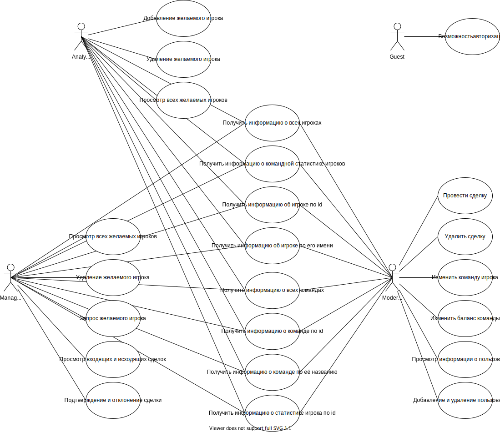

# Система трансферов игроков

## Цель работы
Целью данной работы является создание web-приложения для получения информации об игроках доступной базы данных, для их покупки и продажи клубами.

## Функциональные требования
Приложение включает в себя несколько ролей, которым доступны различные функции

### Аналитик
> Имеет доступ к данным о командах и игроках, может отправлять игрока на покупку менеджеру
### Менеджер
> Может просматривать игроков, посылаемых аналитиком, отправлять и подтверждать сделки с другими менеджерами
### Модератор
> Имеет список сделок от менеджеров, может менять денежный баланс команд, команду игрока. Изменение другой информации игроков и команд.

## Use-case диаграмма системы

## ER-диаграмма сущностей системы

## Диаграмма БД

